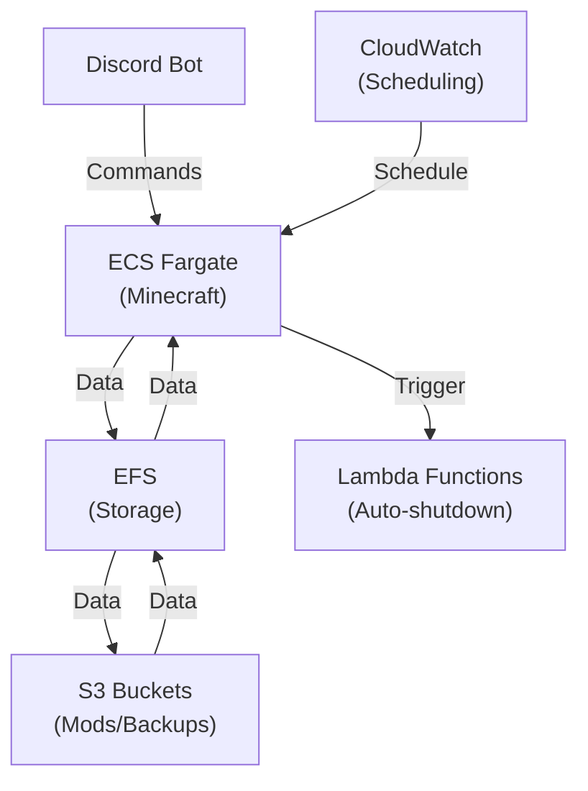

# Minecraft ECS Discord

A lightweight Minecraft server hosted on AWS ECS Fargate with Discord integration for weekend gaming sessions.

## Overview

This project sets up a Minecraft server on AWS ECS Fargate that can be controlled via Discord commands. The server is designed to be cost-effective by only running when needed and automatically shutting down at night.

### Features

- **AWS ECS Fargate** hosting for Minecraft server (dynamic IP)
- **Discord integration** with commands (`/start`, `/stop`, `/status`)
- **IP notification** in Discord when server starts
- **Automatic shutdown** at 20:00 JST (via Lambda + CloudWatch Events)
- **Mod support** with S3 storage and EFS synchronization
- **Backup/restore** functionality
- **Fully automated deployment** via GitHub Actions

## Architecture



The architecture consists of:

- **AWS ECS Fargate** for running the Minecraft server container
- **EFS** for persistent storage of the Minecraft world data
- **S3** for storing mods and backups
- **Lambda** functions for Discord bot and auto-shutdown
- **API Gateway** for Discord webhook integration
- **CloudWatch** for scheduling and monitoring

## Prerequisites

- AWS Account with appropriate permissions
- Discord Bot Token and Server with a designated channel
- GitHub Account for CI/CD
- Terraform >= 1.0.0 (for local development)
- Docker (for local development)

## Setup Instructions

For detailed setup and deployment instructions, see the [Deployment Guide](docs/deployment-guide.md).

### Quick Start

1. Fork and clone this repository
2. Set up a Discord bot and get the token and channel ID
3. Add the required secrets to your GitHub repository
4. Push to the main branch or manually trigger the GitHub Actions workflow
5. Wait for the deployment to complete (15-20 minutes)
6. Use the Discord commands to control your Minecraft server

### Local Testing

For local testing of the Terraform configuration:

1. Copy `.env.example` to `.env` and fill in your AWS credentials and other settings
2. Use the Makefile to initialize, plan, and apply the Terraform configuration:

```bash
make help    # Show available commands
make plan    # Plan Terraform changes
make apply   # Apply Terraform changes
```

See the [Local Testing with Makefile Guide](docs/terraform-local-testing.md) for detailed instructions.

## Usage

### Discord Commands

- `/start` - Start the Minecraft server
- `/stop` - Stop the Minecraft server
- `/status` - Check the status and get the IP address

### Adding Mods

Upload mod JAR files to the S3 bucket:

```bash
aws s3 cp your-mod.jar s3://minecraft-ecs-discord-mods/
```

The mods will be automatically synchronized to the server.

### Backups

Backups are automatically created when the server stops. To manually create a backup:

```bash
aws ecs run-task \
  --cluster minecraft-ecs-discord-cluster \
  --task-definition minecraft-ecs-discord-backup \
  --launch-type FARGATE \
  --network-configuration "awsvpcConfiguration={subnets=[subnet-id],securityGroups=[sg-id],assignPublicIp=ENABLED}"
```

To restore from a backup:

```bash
aws ecs run-task \
  --cluster minecraft-ecs-discord-cluster \
  --task-definition minecraft-ecs-discord-restore \
  --launch-type FARGATE \
  --network-configuration "awsvpcConfiguration={subnets=[subnet-id],securityGroups=[sg-id],assignPublicIp=ENABLED}" \
  --overrides '{"containerOverrides": [{"name": "restore", "environment": [{"name": "BACKUP_FILE", "value": "world-backup-20230101-120000.tar.gz"}]}]}'
```

## Cost Optimization

This setup is designed to be cost-effective:

- Server only runs when needed (controlled via Discord)
- Automatic shutdown at night
- Uses Fargate spot instances where possible
- EFS lifecycle policy to move infrequently accessed data to lower-cost storage

## Troubleshooting

### Server Not Starting

Check CloudWatch Logs for the ECS service:

```bash
aws logs get-log-events --log-group-name /ecs/minecraft-ecs-discord --log-stream-name minecraft/latest
```

### Discord Bot Not Responding

Check the Lambda function logs:

```bash
aws logs get-log-events --log-group-name /aws/lambda/minecraft-ecs-discord-discord-bot --log-stream-name latest
```

## License

This project is licensed under the MIT License - see the LICENSE file for details.
